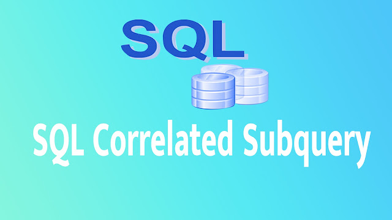

# CorrelatedSubquerry

| Column            | Description                                   | Data Type        |
|-------------------|-----------------------------------------------|------------------|
| EID        | Employee Id                     | NUMBER(3)      |
| FNAME            | First name            | VARCHAR(10)       |
| SALARY        | SALARY                     | NUMBER(6)      |
| DID            | Department Id            | Number(3)       |

A correlated subquery is a type of SQL subquery where the inner query 
references one or more columns from the outer query. 
In other words, the subquery is dependent on the outer query,
and the execution of the subquery is influenced by the values of the outer query.